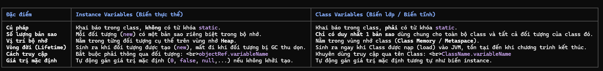

# Class Variables (Biến lớp) và Instance Variables (Biến thực thể) trong Java

Chào em! Là Java mentor của em, anh đã hệ thống hóa và ghi lại chi tiết kiến thức về **Class Variables** và **Instance Variables** vào đây. Đây là một nền tảng vô cùng quan trọng để giúp em ăn điểm tuyệt đối trong các câu hỏi liên quan đến biến, bộ nhớ, và tính kế thừa/đa hình trong OCA/OCP.

---

## 1. Bản chất và Định nghĩa

### A. Instance Variables (Biến thực thể)
* **Khái niệm:** Là biến được khai báo bên trong class nhưng nằm ngoài mọi phương thức, constructor hay block khởi tạo, và **không** có từ khóa `static`.
* **Đặc trưng:** Mỗi khi một đối tượng mới được tạo ra bằng từ khóa `new`, JVM sẽ cấp phát một không gian bộ nhớ riêng biệt cho các biến thực thể của đối tượng đó. Các đối tượng khác nhau sẽ có giá trị biến thực thể khác nhau và hoàn toàn độc lập với nhau.
* **Bộ nhớ:** Lưu trữ trực tiếp bên trong đối tượng trên vùng nhớ **Heap**.

### B. Class Variables (Biến lớp / Biến tĩnh)
* **Khái niệm:** Là biến được khai báo bên trong class, nằm ngoài các phương thức và **phải có từ khóa `static`** đi kèm.
* **Đặc trưng:** Chỉ có **duy nhất một bản sao** của biến lớp được tạo ra cho toàn bộ class, bất kể class đó có bao nhiêu đối tượng được khởi tạo. Tất cả các đối tượng của class này đều dùng chung bản sao đó.
* **Bộ nhớ:** Được lưu trữ trong vùng nhớ **Class Memory** (nằm trong **Heap** hoặc **Metaspace** tùy phiên bản Java). Được nạp vào bộ nhớ ngay khi class được load lên bởi JVM, trước khi bất kỳ đối tượng nào được tạo ra.

---

## 2. Bảng so sánh chi tiết

| Đặc điểm | Instance Variables (Biến thực thể) | Class Variables (Biến lớp / Biến tĩnh) |
| :--- | :--- | :--- |
| **Từ khóa** | Không dùng `static`. | Bắt buộc phải dùng `static`. |
| **Số lượng bản sao** | Mỗi đối tượng có một bản sao riêng biệt. | Chỉ có duy nhất 1 bản sao dùng chung cho toàn bộ Class. |
| **Vùng nhớ** | **Heap** (bên trong đối tượng cụ thể). | **Class Memory / Metaspace** (gắn liền với Class). |
| **Vòng đời (Lifetime)** | Gắn với đối tượng. Sinh ra khi `new` và mất đi khi bị Garbage Collector (GC) thu gom. | Gắn với Class. Sinh ra khi Class được load và sống tới khi JVM tắt. |
| **Cách truy cập** | **Qua tham chiếu đối tượng:** `obj.variableName` | **Qua tên Class (Khuyên dùng):** `ClassName.variableName` |
| **Giá trị mặc định** | Có. Tự động gán mặc định (`0`, `false`, `null`...) nếu không khởi tạo. | Có. Tự động gán mặc định tương tự biến instance. |



---

## 3. Những "Cạm bẫy" OCA/OCP cần đặc biệt lưu ý

### ⚠️ Bẫy 1: Truy cập thành viên Static qua biến tham chiếu `null`
Đây là bẫy lừa xuất hiện cực kỳ nhiều. Khi một biến tham chiếu có giá trị là `null`, nếu gọi biến static từ biến này, chương trình **vẫn chạy bình thường** mà không hề ném ra `NullPointerException`.
```java
class Counter {
    public static int count = 100;
}

public class Main {
    public static void main(String[] args) {
        Counter c = null; 
        System.out.println(c.count); // KẾT QUẢ: In ra 100! Không có lỗi gì cả.
    }
}
```
* **Giải thích:** Trình biên dịch Java sẽ tự động tối ưu hóa lệnh `c.count` thành `Counter.count` tại thời điểm biên dịch vì `count` là tĩnh. JVM không cần giải quyết tham chiếu `c` tại Runtime, do đó không bao giờ xảy ra lỗi NullPointer.

### ⚠️ Bẫy 2: Nguyên tắc truy cập bất đối xứng (Access Rules)
* **Thành phần tĩnh (Static):** **Không** thể gọi hoặc truy cập trực tiếp thành phần phi tĩnh (non-static) vì thời điểm thành phần tĩnh tồn tại, đối tượng phi tĩnh có thể chưa được tạo ra.
* **Thành phần phi tĩnh (Non-static):** Có thể truy cập trực tiếp cả static lẫn non-static tự do.
```java
class Student {
    String name;      // Instance variable
    static String school = "Java Academy"; // Class variable

    public static void printInfo() {
        // System.out.println(name); // ❌ LỖI BIÊN DỊCH! Không thể truy cập non-static trong static context
        System.out.println(school);   //  HỢP LỆ!
        
        Student s = new Student();
        System.out.println(s.name);  //  HỢP LỆ (vì truy cập qua đối tượng s cụ thể)
    }
}
```

### ⚠️ Bẫy 3: Biến Class kết hợp với hằng số `static final`
Khi kết hợp `static` và `final`, biến đó trở thành một **hằng số (constant)** gắn liền với Class.
* Hằng số static bắt buộc phải được khởi tạo giá trị tại:
  1. Ngay dòng khai báo: `public static final int MAX_LIMIT = 50;`
  2. Bên trong **Static Initialization Block (SIB)**.
* ❌ **Tuyệt đối không** được khởi tạo hằng số tĩnh trong Constructor hay Instance Block (IIB).
```java
class Config {
    public static final String API_KEY;
    
    // Hợp lệ
    static {
        API_KEY = "SECRET_KEY_123";
    }
    
    // ❌ LỖI BIÊN DỊCH nếu gán trong Constructor
    /*
    public Config() {
        API_KEY = "KEY"; 
    }
    */
}
```

---

## 4. Phân biệt nhanh với Local Variables (Biến cục bộ)
Để không bị nhầm lẫn khi làm bài thi trắc nghiệm, em cần nhớ:
* **Local variable** là biến được khai báo bên trong một phương thức, constructor hoặc block.
* Nó **không được tự động gán giá trị mặc định**.
* Nếu em cố tình đọc/sử dụng một local variable chưa được khởi tạo, Java sẽ báo lỗi biên dịch (*Variable might not have been initialized*).

---

Hãy xem lại thật kỹ ghi chú này nhé! Bất cứ khi nào em cần làm bài tập vận dụng để tăng phản xạ, hãy báo với anh! Chúc em học tốt!
