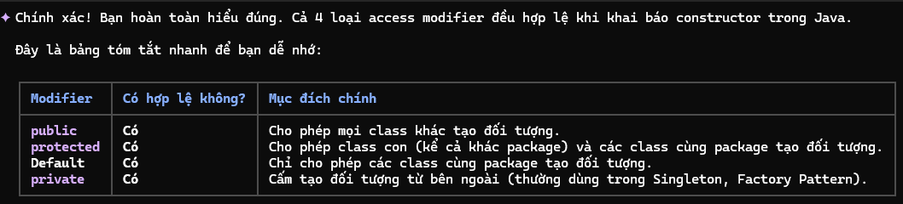
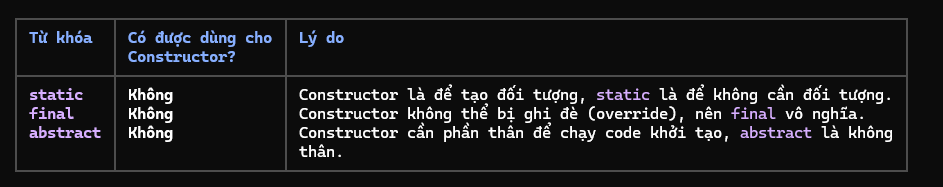

Constructor trong Java

1. Khái niệm
    - Constructor là một phương thức đặc biệt được sử dụng để khởi tạo đối tượng. Khi sử dụng từ khóa "new" để tạo một đối tượng từ class, constructor sẽ được gọi tự động.
    - Tên: tên của contructor phải trùng với tên của class.
    - Kiểu trả về: constructor không có kiểu trả về.
    - Một class có thể có nhiều constructor (Constructor overloading)

2. Các loại constructor
    - Default constructor: nếu không tự khai báo thì Java sẽ tự động tạo ra một constructor rỗng
    - No-Argument constructor (constructor không tham số): dùng để thiết lập các giá trị mặc định cụ thể cho đối tượng
    - Parameterized constructor(constructor có tham số): sử dụng để gán giá trị cụ thể cho các thuộc tính ngay khi khởi tạo đối tượng

3. Quy tắc this() và super()
    - Câu lệnh đầu tiên trong một constructor phải là super() (gọi constructor của lớp cha) hoặc this() (gọi constructor khác cùng lớp)
    - Nếu không được viết, trình biên dịch sẽ mặc định thêm super() vào dòng đầu tiên.

4. Mục đích và bản chất
    - Khởi tạo thay vì tạo mới: Thực tế, từ khóa "new" là thứ tạo ra đối tượng, còn constructor được dùng để khời tạo các giá trị cho đối tượng đó.

5. Phạm vi truy cập
    - Access modifier: public, protected, default và private

    

    - Constructor không thể khai báo là static, final và abstract. 
        + lý do: static được dùng trước khi đối tượng được tạo, trong khi constructor dùng để khởi tạo đối tượng. final không cần thiết vì constructor vốn dĩ không thể bị override. Constructor bắt buộc phải có phần thân để thực hiện logic khởi tạo, trong khi abstract thì không có phần thân. Ngoài ra, nếu một constructor abstract, bạn sẽ không bao giờ có thể khởi tạo được đối tượng của lớp đó hoặc lớp con của nó (vì lớp con luôn phải gọi constructor của lớp cha) 

    

