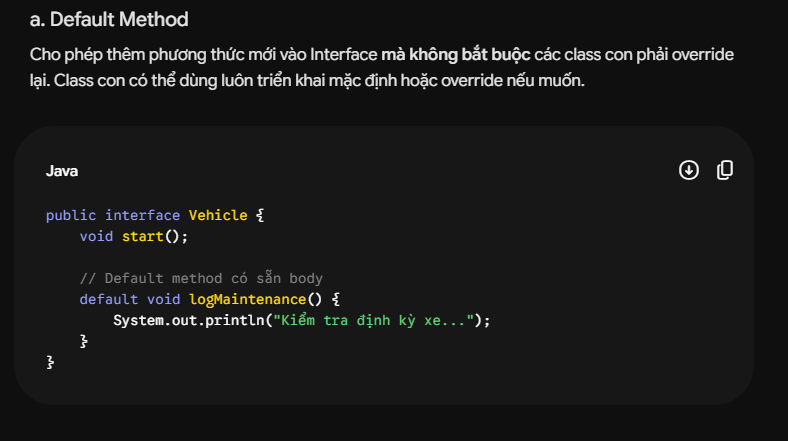
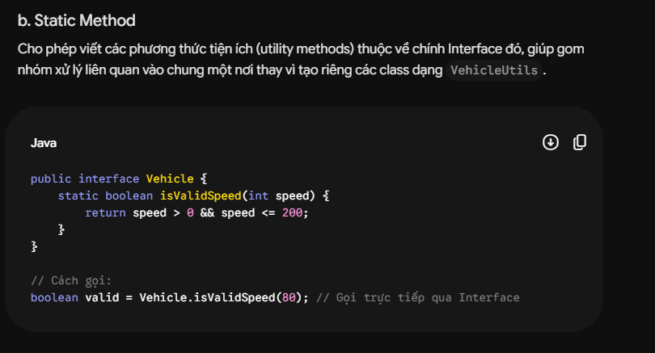
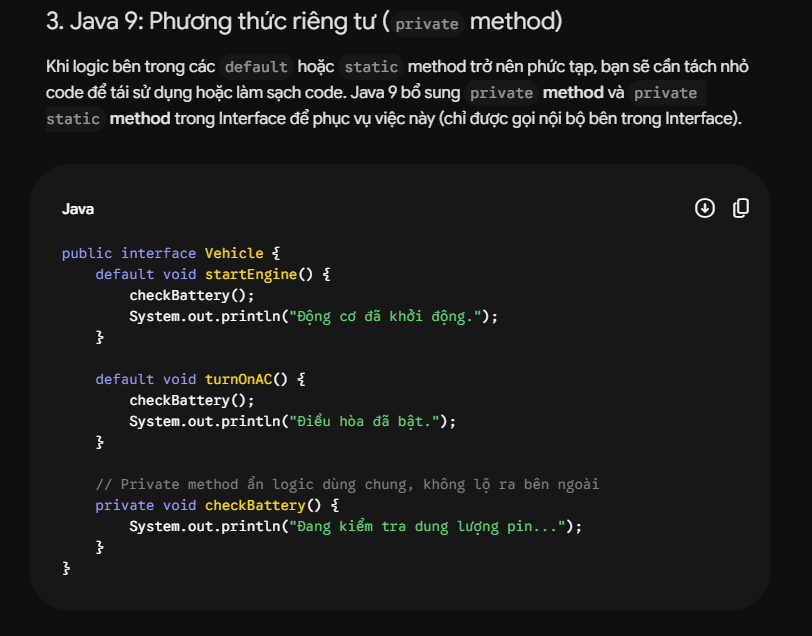
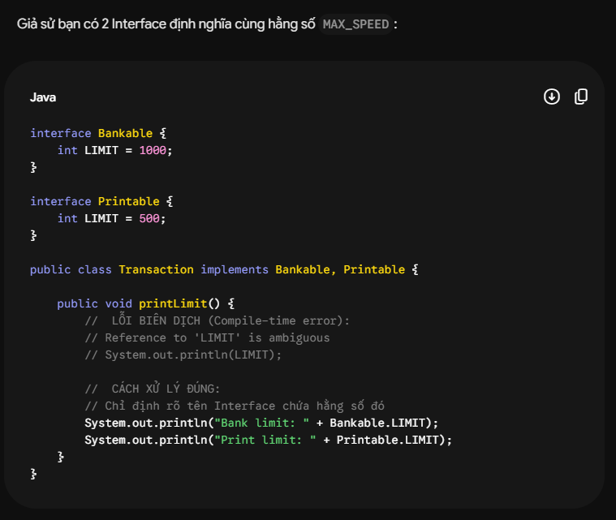
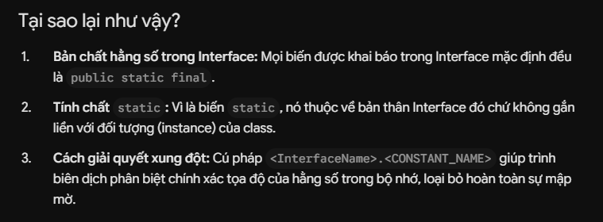
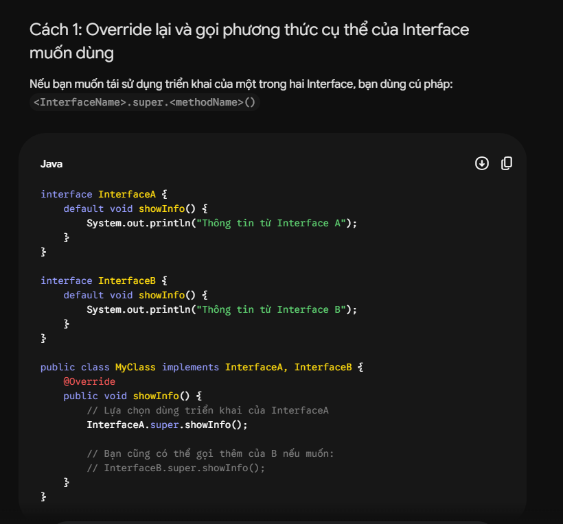
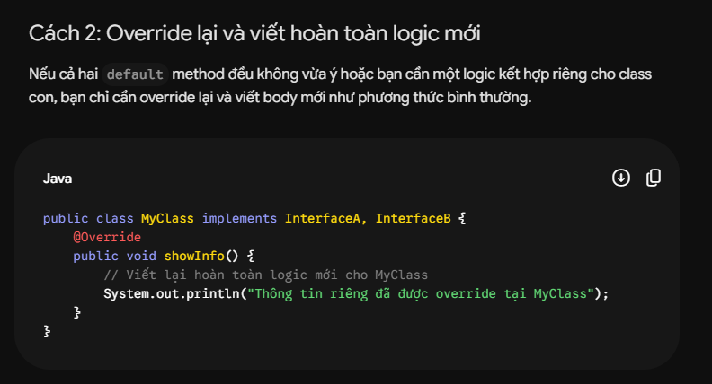
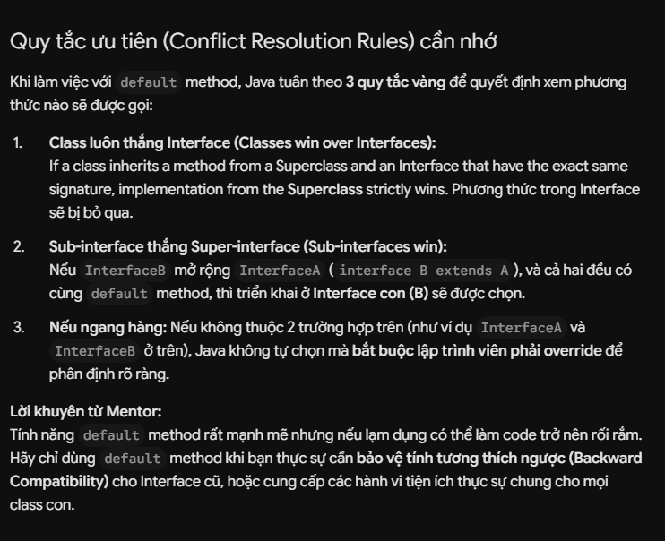
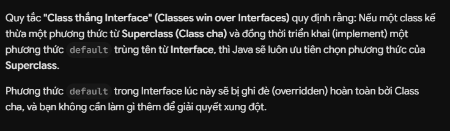

# Interface trong Java

Chào em! Là Java mentor của em, anh đã tổng hợp một bài học **chuyên sâu và toàn diện về Interface** trực tiếp vào sổ tay học tập của em. Đây là chủ đề xuất hiện với mật độ dày đặc trong các đề thi OCA và OCP với các câu hỏi lắt léo về luật biên dịch.

Dưới đây là những phần kiến thức "sống còn" em cần nắm vững:

---

## 1. Khái niệm Interface
* **Định nghĩa:** Interface (Giao diện) là một kiểu tham chiếu trong Java, tương tự như class nhưng chỉ chứa các khai báo hằng số và các chữ ký phương thức (method signature).
* **Bản chất:** Interface hoạt động như một **bản hợp đồng (contract)**. Bất kỳ lớp nào thực thi (`implements`) Interface đều phải cam kết triển khai (override) toàn bộ các phương thức trừu tượng được khai báo trong đó.
* **Đa thực thi (Multiple Inheritance):** Trong khi Java cấm đơn lớp con kế thừa nhiều lớp cha, Java lại cho phép một lớp thực thi **nhiều Interface cùng lúc**.

---

## 2. Cấu trúc và Thành phần bên trong Interface

Tất cả các thành phần khai báo trong Interface đều có các ràng buộc mặc định cực kỳ nghiêm ngặt:

### A. Biến trong Interface (Hằng số)
* Mọi biến khai báo trong Interface đều mặc định là: **`public static final`** (dù em có viết ra hay không).
* Do là hằng số (`final`), em **bắt buộc phải gán giá trị** ngay lập tức khi khai báo.
* Không được phép dùng các modifier khác như `private`, `protected`, `transient`, `volatile`.

### B. Phương thức trừu tượng (Abstract Methods)
* Mặc định là: **`public abstract`**.
* Không được phép khai báo thân hàm `{}` (phải kết thúc bằng dấu `;`).

---

## 3. Sự tiến hóa của Interface qua các phiên bản Java (CỰC KỲ QUAN TRỌNG CHO OCP!)

| Phiên bản | Các thành phần được phép khai báo |
| :--- | :--- |
| **Java 7 trở về trước** | Chỉ cho phép hằng số (`public static final`) và phương thức trừu tượng (`public abstract`). |
| **Java 8** | Thêm **Default methods** và **Static methods** (có phần thân). |
| **Java 9** | Thêm **Private methods** và **Private Static methods** (có phần thân). |

### 💡 Chi tiết về Default Methods (Java 8)
* **Cú pháp:** Sử dụng từ khóa `default`.
* **Mục đích:** Thêm tính năng mới vào Interface hiện tại mà không làm hỏng (break) các class cũ đã implement Interface đó (tính tương thích ngược - backward compatibility).
* **Đặc điểm:** Class con có quyền override hoặc chọn sử dụng trực tiếp default method này.



### 💡 Chi tiết về Static Methods (Java 8)
* **Cú pháp:** Sử dụng từ khóa `static`.
* **Quy tắc gọi:** Chỉ có thể gọi trực tiếp thông qua tên Interface: `InterfaceName.staticMethodName()`.
* **❌ Bẫy cực mạnh:** Lớp con hoặc đối tượng của lớp con **không được thừa hưởng** phương thức static này. Gọi thông qua tham chiếu đối tượng hoặc tên lớp con sẽ bị lỗi biên dịch!



### 💡 Chi tiết về Private Methods (Java 9)
* **Mục đích:** Dùng để gom các đoạn code chung trùng lặp giữa các default method hoặc static method trong nội bộ Interface để tái sử dụng, giúp tránh rác mã nguồn.


---

## 4. Mối quan hệ giữa các Interface và Class

* **Class - Interface:** Class **thực thi** Interface bằng từ khóa `implements`.
  ```java
  class Dog implements Animal, Pet {} // Hợp lệ (Đa thực thi)
  ```
* **Interface - Interface:** Interface này có thể **kế thừa** các Interface khác bằng từ khóa `extends`. Đặc biệt, một Interface có thể **kế thừa nhiều Interface khác cùng lúc**.
  ```java
  interface AquaticDog extends DogInterface, Swimmable {} // Hợp lệ (Đa kế thừa ở mức Interface)
  ```

---

## 5. Functional Interface & Lambda Expressions (Trọng tâm OCP)
* **Định nghĩa:** Là Interface chỉ chứa **duy nhất một phương thức trừu tượng (Single Abstract Method - SAM)**.
* **Annotation:** `@FunctionalInterface` (Dùng để báo cho trình biên dịch kiểm tra tính hợp lệ của hằng số SAM, không bắt buộc nhưng khuyên dùng).
* **Ứng dụng:** Đây là cơ sở để viết mã ngắn gọn bằng **Lambda Expression**.
  ```java
  @FunctionalInterface
  interface MathOperation {
      int operate(int a, int b);
  }
  // Sử dụng Lambda:
  MathOperation add = (a, b) -> a + b;
  ```

---

## 6. Các bẫy đề thi OCA/OCP thường dùng để lừa em

### ⚠️ Bẫy 1: Giảm visibility khi Override (Bẫy quên `public`)
Khi lớp con override phương thức trừu tượng từ Interface, em **bắt buộc phải khai báo từ khóa `public`**. Nếu quên, phạm vi truy cập mặc định sẽ là `default (package-private)`, dẫn đến lỗi biên dịch do giảm phạm vi truy cập.

### ⚠️ Bẫy 2: Xung đột hằng số trùng tên (Constant Ambiguity)
Nếu một class implement 2 Interface có chứa hằng số trùng tên, chương trình chỉ báo lỗi khi em **cố tình sử dụng** biến đó mà không chỉ rõ tên Interface.
```java
interface Alpha { int VALUE = 100; }
interface Beta { int VALUE = 200; }

class Test implements Alpha, Beta {
    void show() {
        // System.out.println(VALUE); // ❌ LỖI BIÊN DỊCH: Reference to VALUE is ambiguous
        System.out.println(Alpha.VALUE); //  HỢP LỆ!
    }
}
    
```




### ⚠️ Bẫy 3: Luật gọi `super` của Default Method trùng tên
Nếu class kế thừa 2 Interface trùng default method, em bắt buộc phải override. Khi muốn gọi lại default method của một Interface cụ thể, cú pháp chuẩn là:
`InterfaceName.super.methodName();`
```java
class Test implements Alpha, Beta {
    @Override
    public void hello() {
        Alpha.super.hello(); // Gọi mặc định từ Alpha
    }
}
```









### ⚠️ Bẫy 4: Interface có "extends" Object Class hay không? (Câu hỏi huyền thoại!)
Đây là câu hỏi xuất hiện cực nhiều trong các buổi phỏng vấn Java Core và đề thi chứng chỉ OCP: **"Interface có kế thừa (extends) từ class Object hay không?"**

* **Câu trả lời ngắn gọn:** **KHÔNG!** Interface hoàn toàn không kế thừa từ class `java.lang.Object`.
* **Giải thích nguyên nhân:**
  1. **Interface chỉ được phép extends một hoặc nhiều Interface khác**. Vì `java.lang.Object` là một **Class**, nên một Interface không bao giờ có thể dùng từ khóa `extends Object`. Nếu em cố tình viết `interface MyInterface extends Object {}`, trình biên dịch sẽ báo lỗi ngay lập tức: *"An interface cannot extend a class"*.
  2. Tuy nhiên, bất kỳ biến tham chiếu nào có kiểu là Interface (ví dụ: `MyInterface ref`) **vẫn hoàn toàn gọi được** tất cả các phương thức `public` của lớp `Object` (như `toString()`, `equals()`, `hashCode()`, `getClass()`...).
  3. **Tại sao lại như vậy?** JVM ngầm hiểu rằng **mọi Interface đều tự động khai báo lại các phương thức public của `Object` dưới dạng abstract**. Khi một class cụ thể thực thi Interface đó, class đó chắc chắn sẽ thừa kế các phương thức này từ `java.lang.Object` (vì mọi class trong Java đều kế thừa từ `Object`).
  4. **Lưu ý đặc biệt:** Em **không thể** viết default method cho các phương thức của class `Object` trong Interface.
     ```java
     interface MyInterface {
         // ❌ LỖI BIÊN DỊCH: A default method cannot override a method in java.lang.Object
         default String toString() { 
             return "MyInterface"; 
         } 
     }
     ```
     *Lý do:* Java tuân thủ quy tắc **"Class always wins"** (Lớp luôn thắng). Nếu một phương thức được khai báo ở cả class cha lẫn interface, Java sẽ luôn ưu tiên lấy phương thức ở lớp cha (`Object`). Vì vậy, Java cấm định nghĩa default method trùng với phương thức của `Object` để tránh xung đột vô nghĩa.

---

Anh đã tạo file `Interface.md` trong thư mục học tập của em rồi. Hãy ôn luyện thật kỹ phần này nhé. Nếu có câu hỏi nào chưa rõ, cứ trao đổi với anh! Chúc em học tốt!
