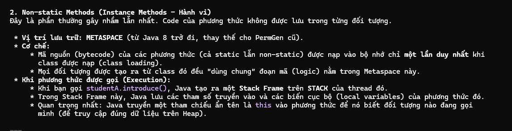
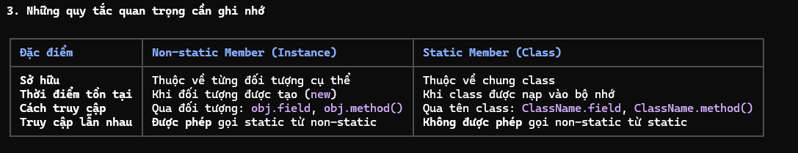

Non-static members 

1. Định nghĩa
    - Non-static member bao gồm các non-static variables và non-static methods. Chúng thường được gọi là instance members.

2. Lưu trữ và quản lý bộ nhớ
    - được lưu trữ bên trong Object memory, là 1 phần của vùng nhớ HEAP.
    - khi lệnh "new" được thực thi, một không gian bộ nhớ nhẫu nhiên trong Heap sẽ được cấp phát cho đối tượng.
    - Biến tham chiếu trên Stack: Trong khi đối tượng nằm ở Heap thì biến tham chiếu (ví dụ: a1, a2) trỏ đến đối tượng đó lại nằm ở Stack.

