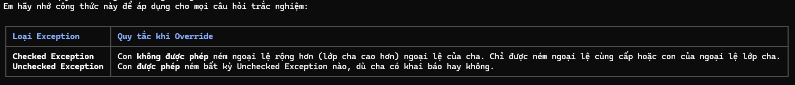

# Polymorphism (Tính đa hình) trong Java

Chào em! Là Java mentor của em, anh đã tổng hợp chi tiết bài học về **Polymorphism (Tính đa hình)** – cột trụ thứ ba cực kỳ thú vị và lắt léo của OOP. Đây chính là chủ đề sinh ra nhiều câu hỏi "hack não" nhất trong đề thi OCA/OCP. 

Dưới đây là những kiến thức cốt lõi giúp em "nhìn thấu" mọi câu hỏi đa hình:

---

## 1. Khái niệm Polymorphism
* **Định nghĩa:** Polymorphism có nghĩa là "nhiều hình thái" (poly = nhiều, morph = hình thái). Trong lập trình, nó cho phép một tham chiếu thuộc lớp cha có thể trỏ tới đối tượng của bất kỳ lớp con nào, và một hành động (phương thức) có thể cư xử khác nhau tùy thuộc vào đối tượng thực tế đang thực hiện hành động đó.
* **Điều kiện cần để có đa hình động:**
  1. Có quan hệ kế thừa (`extends` hoặc `implements`).
  2. Có hành vi ghi đè phương thức (`@Override`).
  3. Sử dụng biến tham chiếu của lớp cha trỏ tới đối tượng lớp con.
     ```java
     SuperClass ref = new SubClass(); // Upcasting
     ```

### 1.1 So sánh chi tiết: Overloading vs Overriding
Đây là bảng tổng hợp những điểm giống và khác nhau quan trọng nhất:

| Đặc điểm | Method Overloading (Nạp chồng) | Method Overriding (Ghi đè) |
| :--- | :--- | :--- |
| **Bản chất** | Nhiều phương thức **cùng tên** nhưng **khác chữ ký (signature)**. | Phương thức ở lớp con **giống hệt** phương thức ở lớp cha. |
| **Mục đích** | Tăng khả năng linh hoạt cho class. | Hỗ trợ tính đa hình động (runtime polymorphism). |
| **Thời điểm quyết định** | **Compile-time** (Trình biên dịch). | **Runtime** (JVM quyết định). |
| **Điều kiện** | Khác tham số (số lượng, kiểu, thứ tự). | Chữ ký phải **giống hệt** (tên, tham số, kiểu trả về). |
| **Phạm vi** | Thường trong cùng 1 class. | Giữa lớp con và lớp cha. |
| **Access Modifier** | Không ràng buộc. | Không được giảm phạm vi truy cập (ví dụ: `protected` -> `private` là lỗi). |
| **Kiểu trả về** | Không quan trọng. | Phải giống hoặc là kiểu Covariant. |
| **Exception Handling** | Không có quy tắc đặc biệt. Có thể ném bất kỳ ngoại lệ nào. | Tuân thủ quy tắc nghiêm ngặt: không được ném Checked Exception rộng hơn lớp cha. |

---


### 1.2 Static Binding vs Dynamic Binding
Để thực sự hiểu sâu về tính đa hình, em cần phân biệt được cơ chế "kết nối" (binding) của Java.

#### A. Static Binding (Early Binding)
*   **Khi nào:** Xảy ra tại thời điểm **Compile-time**.
*   **Cơ chế:** Trình biên dịch (Compiler) xác định phương thức hoặc biến nào sẽ được gọi dựa trên **kiểu tham chiếu (reference type)**.
*   **Áp dụng:** Với các biến (fields), phương thức `private`, `final`, hoặc `static`.
```java
class Parent {
    static void staticMethod() { System.out.println("Parent static"); }
}
// Khi gọi Parent.staticMethod(); -> Binding xảy ra ngay khi compile
```

```java
class Calculator {
    
    // Static binding áp dụng cho Method Overloading
    public int add(int a, int b) {
        return a + b;
    }

    public double add(double a, double b) {
        return a + b;
    }

    // Static binding áp dụng cho static method
    public static void printInfo() {
        System.out.println("Máy tính bỏ túi");
    }

    // Static binding áp dụng cho private method
    private void secretOperation() {
        System.out.println("Xử lý nội bộ");
    }
}

public class Main {
    public static void main(String[] args) {
        Calculator calc = new Calculator();

        // Trình biên dịch biết NGAY LÚC COMPILE dựa vào kiểu dữ liệu truyền vào:
        // (int, int) -> gọi phương thức add(int, int)
        System.out.println(calc.add(5, 10)); 

        // (double, double) -> gọi phương thức add(double, double)
        System.out.println(calc.add(2.5, 3.5)); 

        // Gọi static method -> liên kết thẳng với class Calculator
        Calculator.printInfo(); 
    }
}
```

#### B. Dynamic Binding (Late Binding)
*   **Khi nào:** Xảy ra tại thời điểm **Runtime**.
*   **Cơ chế:** JVM xác định phương thức nào được gọi dựa trên **đối tượng thực tế (actual object)** nằm trên Heap.
*   **Áp dụng:** Với các phương thức có thể override (instance methods).
```java
class Parent {
    void talk() { System.out.println("Parent talk"); }
}
class Child extends Parent {
    void talk() { System.out.println("Child talk"); }
}

Parent p = new Child();
p.talk(); // Runtime mới biết gọi method của Child
```

```java
class Animal {
    public void makeSound() {
        System.out.println("Động vật phát ra tiếng kêu...");
    }
}

class Dog extends Animal {
    @Override
    public void makeSound() {
        System.out.println("Gâu gâu!");
    }
}

class Cat extends Animal {
    @Override
    public void makeSound() {
        System.out.println("Meo meo!");
    }
}

public class Main {
    public static void main(String[] args) {
        // Kiểu khai báo là Animal, nhưng đối tượng thực tế trong Heap là Dog
        Animal myAnimal = new Dog(); 

        // TẠI THỜI ĐIỂM BIÊN DỊCH:
        // Trình biên dịch chỉ biết myAnimal là kiểu Animal và kiểm tra xem Animal có makeSound() không.
        
        // TẠI THỜI ĐIỂM CHẠY (RUNTIME):
        // JVM kiểm tra đối tượng thực tế (là Dog) và quyết định gọi makeSound() của Dog.
        myAnimal.makeSound(); // In ra: Gâu gâu!

        // Thay đổi đối tượng thực tế sang Cat
        myAnimal = new Cat();
        myAnimal.makeSound(); // In ra: Meo meo!
    }
}
```

---
| Đặc điểm | Đa hình Tĩnh (Compile-time / Static) | Đa hình Động (Runtime / Dynamic) |
| :--- | :--- | :--- |
| **Cơ chế** | **Method Overloading** (Nạp chồng phương thức). | **Method Overriding** (Ghi đè phương thức). |
| **Thời điểm quyết định** | **Compile-time** (Trình biên dịch quyết định dựa trên số lượng và kiểu dữ liệu của đối số truyền vào). | **Runtime** (JVM quyết định dựa trên **kiểu của đối tượng thực tế** đang nằm trên Heap). |
| **Ví dụ** | Nhiều phương thức cùng tên nhưng khác tham số trong cùng một class. | Lớp con viết lại phương thức có cùng chữ ký (signature) của lớp cha. |

---

## 3. Bản chất của Tham chiếu và Đối tượng thực tế (Upcasting vs Downcasting)

Khi em viết dòng code:
```java
Animal myDog = new Dog();
```
* **Kiểu tham chiếu (Reference Type):** Là `Animal`. Trình biên dịch (Compiler) chỉ nhìn vào kiểu tham chiếu này. Nó quy định **những phương thức nào em ĐƯỢC PHÉP GỌI** (chỉ gọi được những gì class `Animal` có).
* **Kiểu đối tượng thực tế (Actual Object Type):** Là `Dog`. JVM (lúc Runtime) sẽ nhìn vào kiểu đối tượng thực tế này. Nó quyết định **mã nguồn của class nào thực sự được chạy**.

### A. Upcasting (Ép kiểu lên)
* Là việc gán đối tượng lớp con cho biến tham chiếu lớp cha (như ví dụ `Animal myDog = new Dog();` ở trên).
* Hành vi này diễn ra **tự động và hoàn toàn an toàn** vì mọi con `Dog` hiển nhiên là một `Animal`.

### B. Downcasting (Ép kiểu xuống)
* Là việc chuyển biến tham chiếu lớp cha về lại kiểu lớp con thực tế của nó.
* Hành vi này **bắt buộc phải ép kiểu tường minh** và tiềm ẩn nguy cơ ném ra ngoại lệ **`ClassCastException`** lúc runtime nếu ép kiểu sai.
* **Mẹo an toàn:** Luôn sử dụng toán tử **`instanceof`** để kiểm tra trước khi thực hiện downcasting.
  ```java
  Animal animal = new Dog();
  if (animal instanceof Dog) {
      Dog dog = (Dog) animal; // Ép kiểu an toàn
      dog.bark(); // Gọi được phương thức riêng của Dog
  }
  ```

---

## 4. Ba chiếc bẫy "Trực tử" trong đề thi OCA/OCP

### ⚠️ Bẫy 1: Chỉ có Phương thức có Đa hình – Biến (Fields) thì KHÔNG!
Đây là cái bẫy mất điểm nhiều nhất! Em hãy xăm thuộc lòng quy tắc này:
> **"Methods are overridden (polymorphic), variables are shadowed/hidden (non-polymorphic)."**
*(Phương thức thì ghi đè và có đa hình, còn biến thì bị che khuất và không có đa hình).*

Khi truy cập vào một **biến**, Java sẽ luôn dựa vào **Kiểu tham chiếu (Reference Type)** chứ không quan tâm đối tượng thực tế là gì!

```java
class Parent {
    int x = 10;
}
class Child extends Parent {
    int x = 20;
}

public class Test {
    public static void main(String[] args) {
        Parent p = new Child();
        System.out.println(p.x); // KẾT QUẢ: In ra 10! (Dựa vào kiểu tham chiếu Parent)
    }
}
```

### ⚠️ Bẫy 2: Method Hiding (Ẩn phương thức Static)
Tương tự như biến, phương thức có từ khóa **`static`** không tham gia vào đa hình động. Nếu con khai báo phương thức static trùng tên với static của cha, đó là **Method Hiding**. Phương thức tĩnh nào được gọi sẽ hoàn toàn phụ thuộc vào **Kiểu tham chiếu**.

```java
class Parent {
    public static void print() { System.out.println("Parent"); }
}
class Child extends Parent {
    public static void print() { System.out.println("Child"); }
}

Parent p = new Child();
p.print(); // KẾT QUẢ: In ra "Parent"! (Do kiểu tham chiếu là Parent)
```

### ⚠️ Bẫy 3: Cố gọi phương thức của lớp con từ tham chiếu lớp cha
```java
class Animal {}
class Dog extends Animal {
    void bark() { System.out.println("Woof"); }
}

Animal a = new Dog();
// a.bark(); // ❌ LỖI BIÊN DỊCH! 
```
* **Giải thích:** Trình biên dịch quét lỗi dựa trên kiểu tham chiếu `Animal`. Class `Animal` không hề định nghĩa phương thức `bark()`, nên Compiler sẽ báo lỗi ngay lập tức, mặc dù đối tượng thực tế trên Heap lúc chạy là `Dog`.
* **Cách khắc phục:** Phải Downcasting `((Dog) a).bark()`.

---

Anh đã tạo file `Polymorphism.md` trong thư mục học tập của em rồi. Em hãy đọc kỹ, ngẫm nghĩ và tự mình gõ lại các đoạn code ví dụ trên để mắt thấy tai nghe cách JVM vận hành nhé. Chúc em học tốt!
