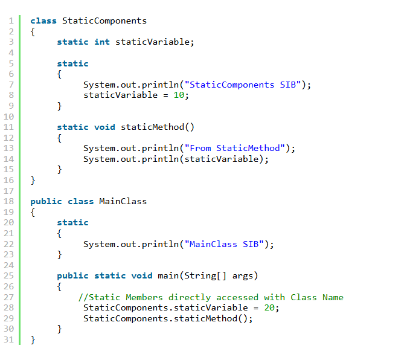

Static member of a class

1. Bản chất của static member
    - Không phục thuộc vào đối tượng: Có thể truy cập các static member trực tiếp thông qua tên lớp mà không cần khởi tạo đối tượng

2. Quản lý bộ nhớ
    - Class memory: các static member được lưu trữ trong một vùng nhớ riêng gọi là Class Memory(nằm trong Heap)
    - Chúng được nạp vào bộ nhớ ngay khi lớp được tải, trước khi bất kỳ đối tượng nào của lớp đó được tạo ra

3. Static Initialization Block(SIB)
    - Mục đích: được sử dụng để khởi tạo các biến tĩnh
    - Đặc điểm: là một đoạn code nằm trong cặp {} và bắt đầu bằng từ khóa static.
    - Quá trình thực thi:
        + SIB được thực thi ngay sau khi các thành phần tĩnh của lớp được nạp vào bộ nhớ và trước khi phương thức main() hoặc constructor được gọi.
        + Khi thực thi, SIB sẽ vào trong Stack, hoàn thành nhiệm vụ và rời khỏi bộ nhớ chứ không lưu trữ lại trong Heap
        + Thứ tự khởi tạo biến tĩnh thường là: gán giá trị mặc định (ví dụ: 0 cho kiểu int) -> thực thi SIB -> gán các giá trị

    

    