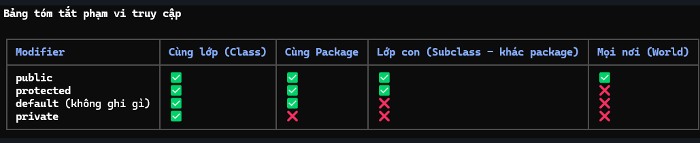
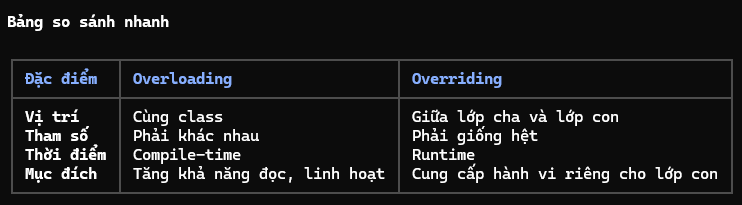

I. Access modifiers <Phạm vi truy cập>
    - Dùng để xác định phạm vi truy cập của các thành phần (class, variable, method) trong Java.
    - public > protected > default > private
        + public: có thể được truy cập từ bất kì đâu.
        + protected: truy cập trong cùng package và các lớp con (kể các lớp con ở package khác)
        + default: truy cập được trong cùng package
        + private: chỉ truy cập được trong cùng 1 class
    

II. Overloading và Overriding
    1. Overloading(nạp chồng phương thức)
        - Bản chất: Compile-time polymorphism (đa hình tại thời điểm biên dịch)
        - Định nghĩa: Nhiều phương thức có cùng tên nhưng khác nhau về danh sách tham số (khác kiểu dữ liệu hoặc số lượng tham số)
        - Quy tắc:  
            + Phải khác tham số đầu vào.
            + Kiểu trả về có thể giống hoặc khác nhau.
            + Modifier có thể thay đổi

    2. Overriding(ghi đè phương thức)
        - Bản chất: Runtime polymorphism (đa hình tại thời điểm chạy)
        - Định nghĩa: lớp con cung cấp cách triển khai cụ thể cho một phương thức ở lớp cha
        - Quy tắc: 
            + Tên và tham số phải giống hệt lớp cha
            + Kiểu trả về phải giống hoặc là kiểu con
            + Access modifier không được bé hơn lớp cha
            + Exception: không được ném ra checked exception mới hoặc rộng hơn lớp cha
            + Không thể override: static method(chỉ có hiding), final method, private method.

   